<div align="center">


<h1>AWS Application Migration Service (MGN) Automation</h1>

<p><strong>Factory-Grade Datacenter Migration, Wave Planning & Automated Cutover Orchestration</strong></p>

[](https://devopstrio.co.uk/)
[](https://devopstrio.co.uk/)
[](https://devopstrio.co.uk/)
[](/apps/wave-engine)

</div>

---

## 🏛️ Executive Summary

**AWS MGN Automation** is a flagship enterprise migration platform designed to industrialize the journey from legacy on-premises datacenters to the AWS cloud. Large-scale migrations often stall due to inconsistent planning, manual replication monitoring, and high-risk cutover windows. This platform transforms the migration process into a **Repeatable Migration Factory**, leveraging the power of **AWS Application Migration Service (MGN)** with a layer of sophisticated orchestration, discovery, and governance automation.

By integrating advanced **Discovery, Wave, and Cutover Engines**, the platform establishes a high-throughput pipeline that standardizes application grouping, manages complex dependencies, and automates high-stakes cutover events using codified runbooks. It provides a boardroom-ready Command Center that gives executives real-time visibility into wave readiness, replication health, and program-level risk registries, ensuring a predictable and zero-downtime migration experience.

### Strategic Business Outcomes
- **Industrialized Migration Velocity**: Achieve high-throughput migration waves through automated replication scheduling and launch configuration standardization.
- **Minimized Operational Risk**: Eliminate human error in high-pressure cutover windows through codified runbooks, automated DNS switchovers, and pre-flight validation testing.
- **Full-Spectrum Visibility**: Gain granular control over migration timelines, costs, and dependencies via a premium dashboard and automated executive reporting.
- **Modernized Governance**: Enforce security baselines, tagging standards, and compliance gates across every migrated workload automatically.

---

## 🏗️ Technical Architecture Details

### 1. High-Level Migration Factory Architecture
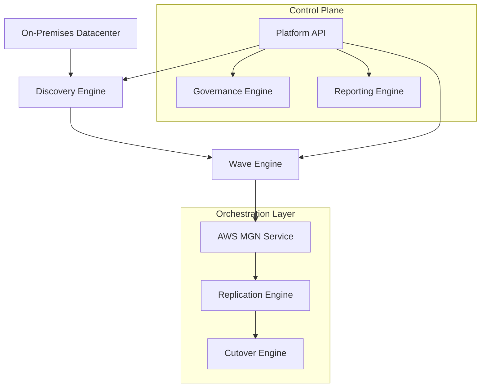

### 2. Discovery & Dependency Workflow
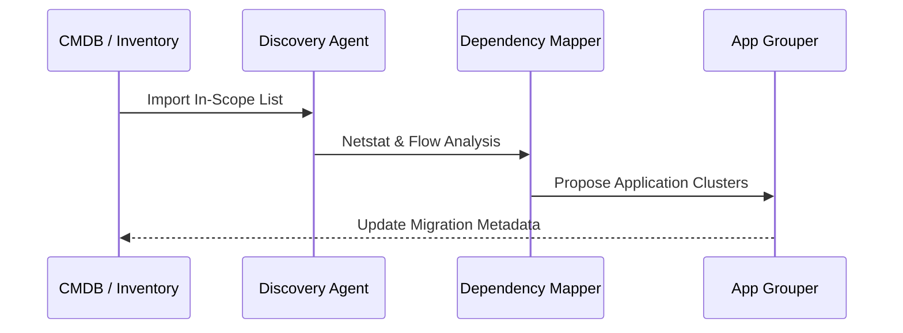

### 3. Wave Planning Lifecycle
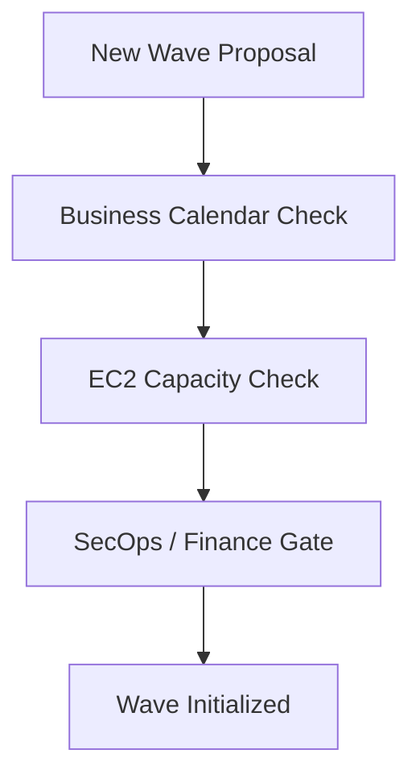

### 4. Replication Orchestration Flow
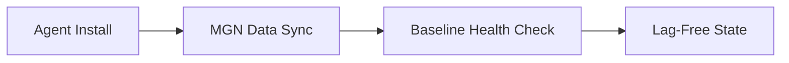

### 5. Cutover Execution Workflow
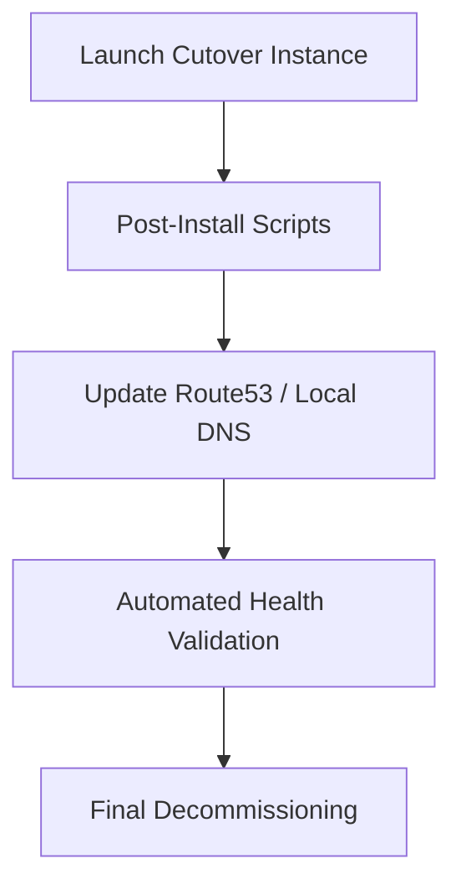

### 6. Security Trust Boundary
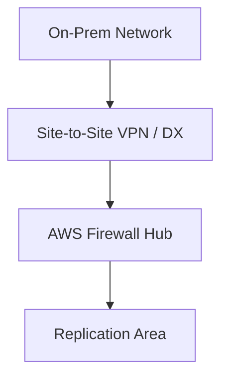

### 7. AWS Global Migration Topology
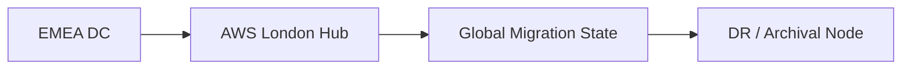

### 8. API Request Lifecycle
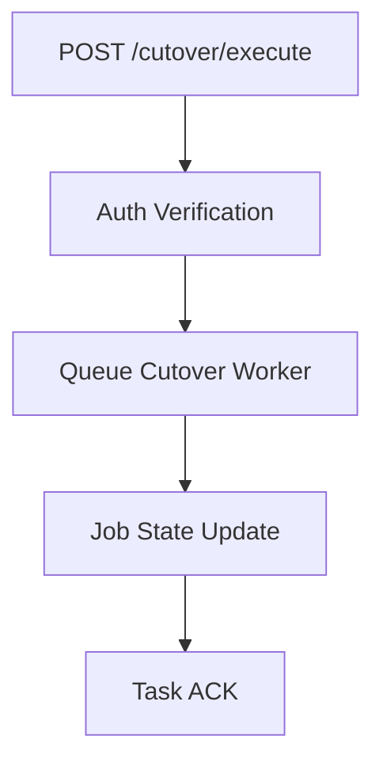

### 9. Multi-Tenant Tenancy Model
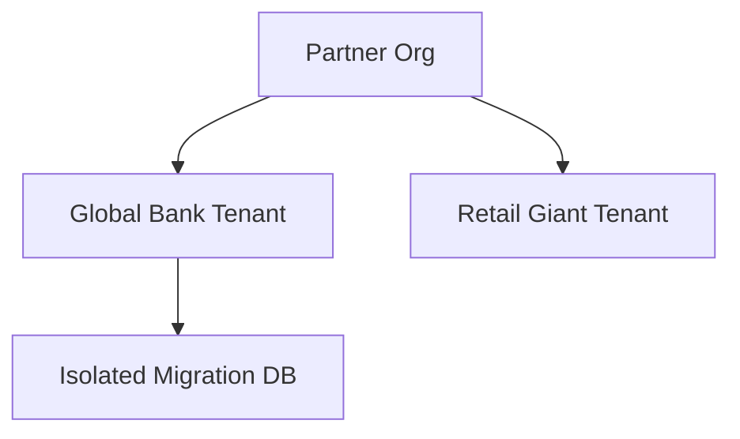

### 10. Monitoring & Throughput Flow
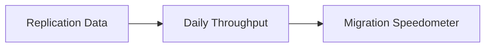

### 11. Disaster Recovery Topology
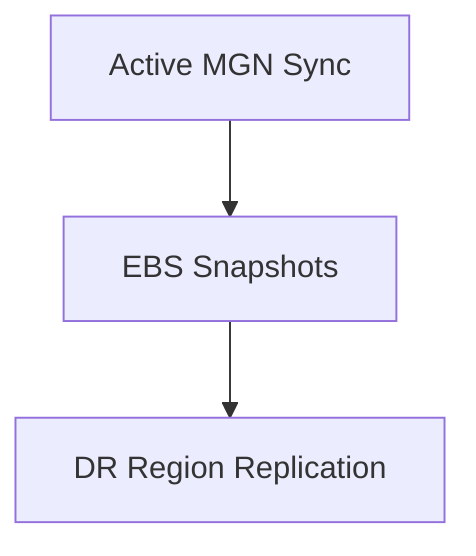

### 12. Dependency Mapping Flow
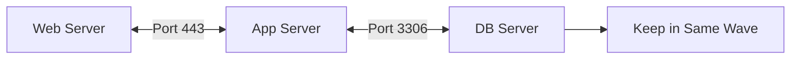

### 13. Identity Federation Model
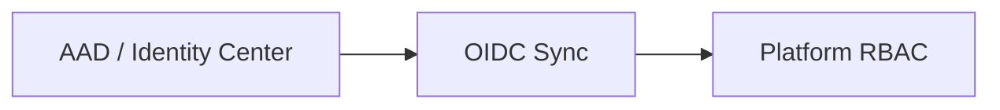

### 14. Executive Approval Gates
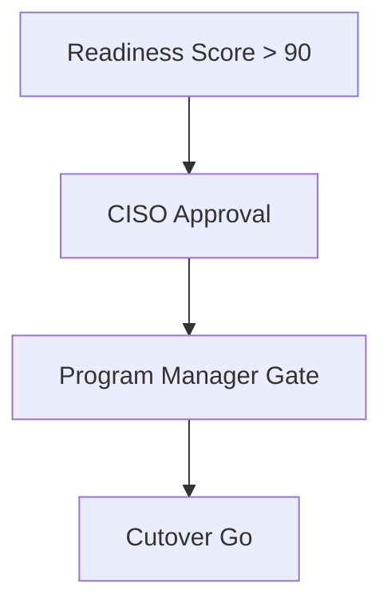

### 15. CI/CD Infrastructure Pipeline
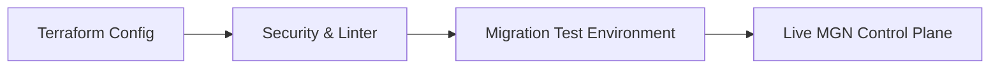

### 16. Factory Throughput Workflow
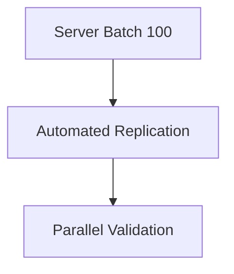

### 17. Rollback Lifecycle
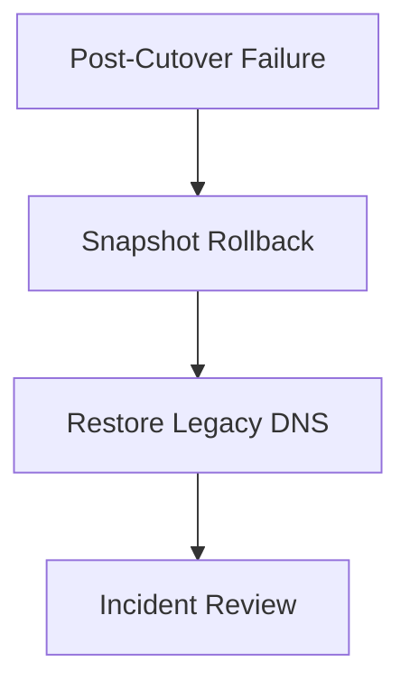

### 18. Global Region Topology
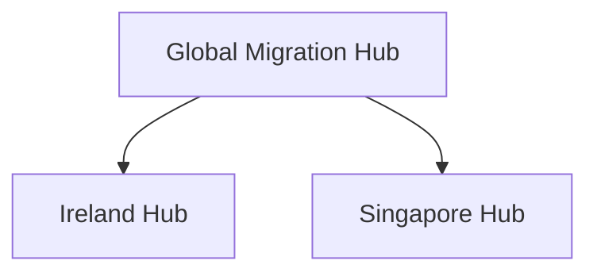

### 19. Hypercare Support Flow
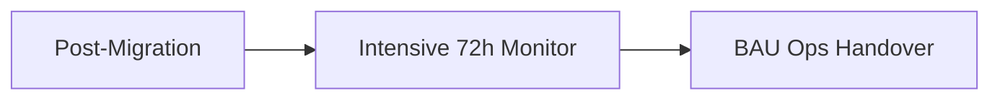

### 20. Cost Governance Workflow
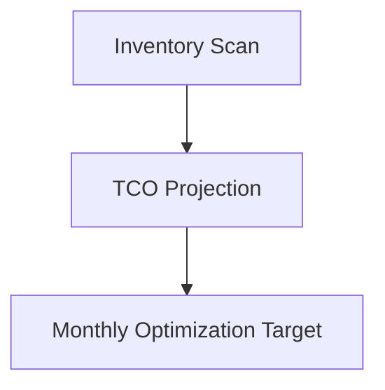

---

## 🚀 Deployment Guide

### Terraform Platform Rollout
```bash
cd terraform/environments/prd
terraform init
terraform apply -auto-approve
```

---
<sub>&copy; 2026 Devopstrio &mdash; Engineering the Scalable Foundation for the Next-Generation Cloud Transformation.</sub>
