<div align="center">


<h1>AWS MGN Automation</h1>

<p><strong>The Institutional-Grade Platform for Standardized Migration Foundations, Wave Governance, and Multi-Cloud Modernization Ecosystems.</strong></p>

[]()
[]()
[]()

<br/>

> **"Industrializing cloud migrations to automate modernization foundations."** 
> **AWS MGN Automation** is an enterprise-grade platform designed to provide a secure, measurable, and highly automated foundation for global datacenter transformations. It orchestrates the complex lifecycle of migrations—from automated discovery and multi-cloud wave reconciliation to high-throughput replication intelligence and unified modernization auditing.

</div>

---

## 🏛️ Executive Summary

Fragmented dependency visibility and manual migration orchestration are strategic operational liabilities; lack of a standardized modernization framework is a primary barrier to organizational engineering maturity. Organizations fail to scale their migration waves not because of a lack of tools, but because of fragmented evaluation standards, lack of automated wave reconciliation, and an inability to orchestrate modernization planes with operational precision.

This platform provides the **Modernization Intelligence Plane**. It implements a complete **AWS-MGN-Automation-as-Code Framework**, enabling CTOs and Migration Architects to manage global modernization foundations as first-class citizens. By automating the identification of dependency regressions through real-time telemetry analysis and orchestrating the provisioning of secure performance-driven modernization policies, we ensure that every organizational workload—from core application servers to edge database instances—is assessed by default, audited for history, and strictly aligned with institutional modernization frameworks.

---

## 📐 Architecture Storytelling: Principal Reference Models

### 1. Principal Architecture: Global Migration Factory & Intelligence Plane
This diagram illustrates the high-level relationship between the On-Premises Datacenter, the Orchestration Layer (Discovery, Wave, Cutover), and the underlying AWS MGN services. It defines the bridge between Migration Engineers and the AWS cloud substrate.

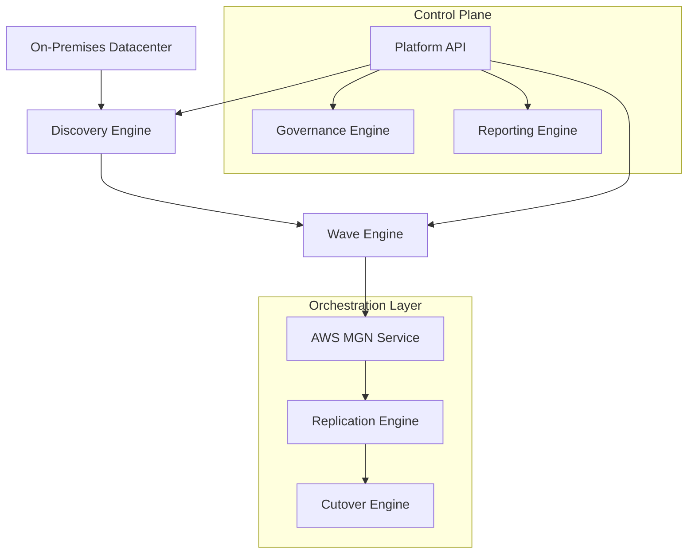

### 2. The Modernization Lifecycle Flow (Discovery & Replication)
The continuous path of a migration platform from CMDB import and netstat/flow analysis to agent installation and lag-free replication status. This ensures zero-interruption operations through dependency-aware wave scheduling.

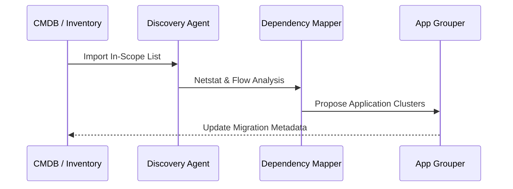

**Replication Orchestration Flow:**
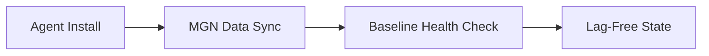

**Factory Throughput Workflow:**
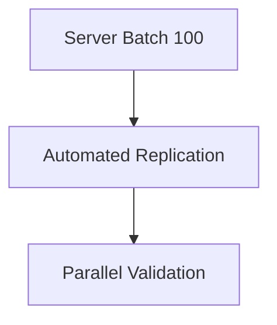

### 3. Distributed Modernization Topology (Dependency & Batch Patterns)
Strategically orchestrating standardized dependency logic across global regions and diverse resource architectures (Web, App, DB), providing a unified institutional view of migration readiness.

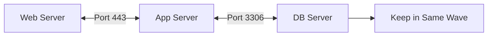

**Cutover Execution Workflow:**
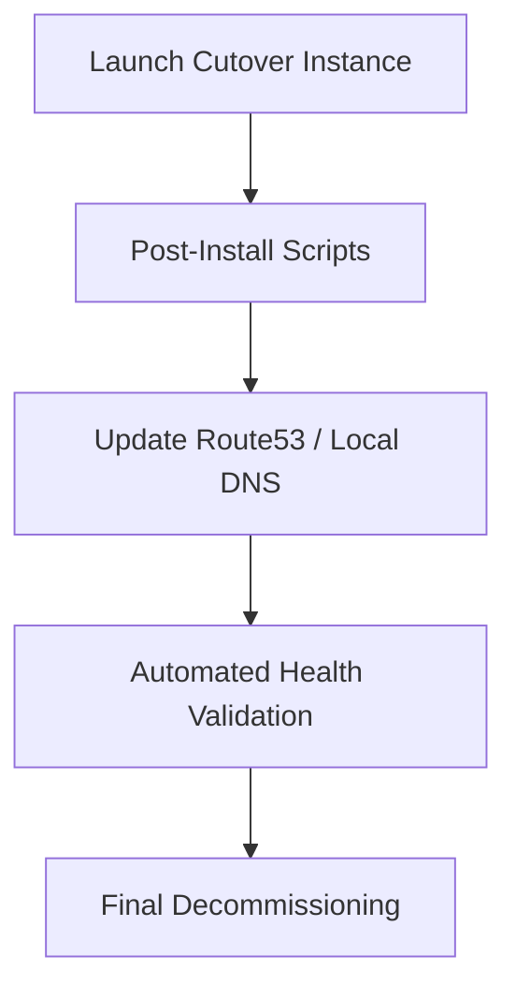

### 4. Governance Hub & Control Plane Flow
Executing complex logic for securing the bridge between business calendars and technical teams, ensuring every wave is authorized, costs are projected, and executive gates are maintained.

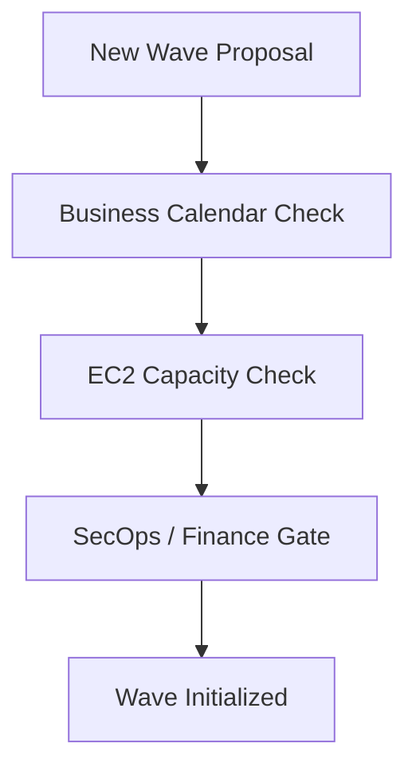

**API Request Lifecycle:**
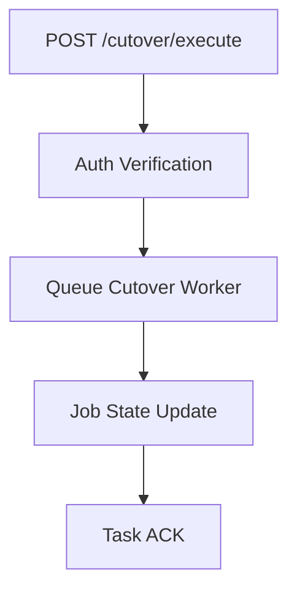

**Cost Governance Workflow:**
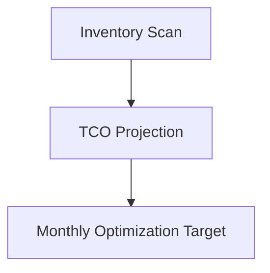

**Executive Approval Gates:**
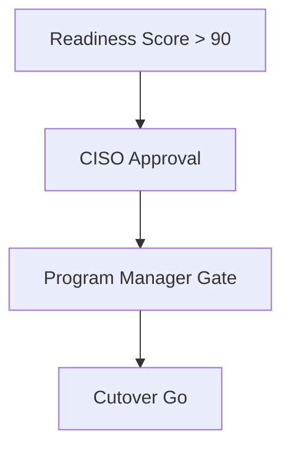

### 5. Multi-Cloud Modernization Federation & Global Topology
Automatically managing unified modernization standards across global regions (London, Singapore) and diverse cloud tenants, ensuring institutional data residency and privacy boundaries by default.

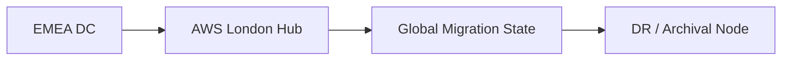

**Global Region Topology:**
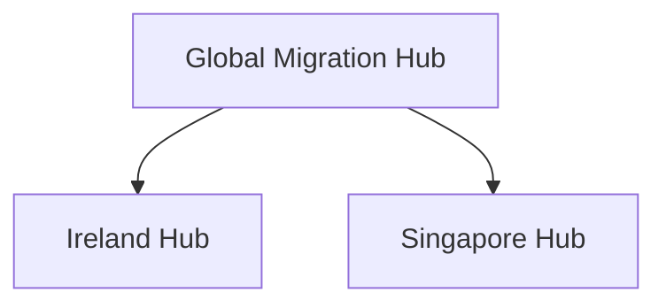

### 6. Encryption & Perimeter Protection Flow (Security Trust Boundary)
Managing the lifecycle of a migration request, automatically enforcing institutional TLS 1.3 and connectivity standards (VPN, Direct Connect, Firewall) as required by security policy, ensuring zero-latency security confidence.

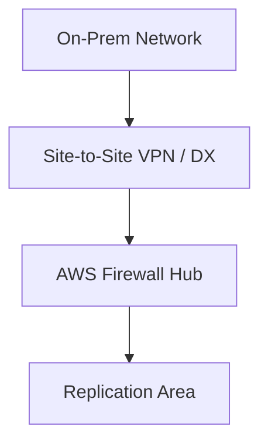

### 7. Institutional Modernization Maturity Scorecard (Throughput Tracking)
Grading organizational performance based on key indicators: Migration Speedometer, Daily Throughput, and Platform Adoption Scores.

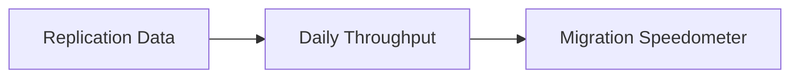

### 8. Identity & RBAC for Migration Governance
Managing fine-grained access to migration hubs, provisioning workers, and audit logs between Global Partners and Customer tenants.

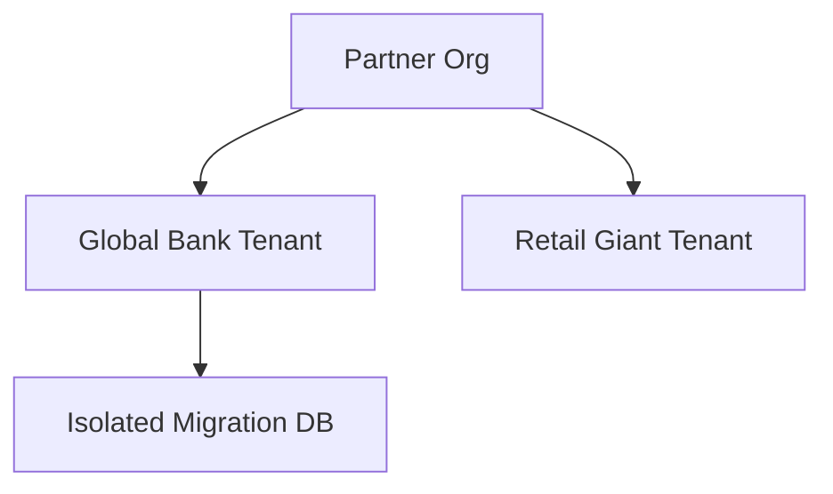

**Identity Federation Model:**
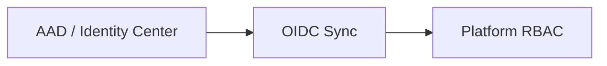

### 9. IaC Deployment: AWS-MGN-Automation-as-Code Framework
Using modular CI/CD pipelines to deploy and manage the versioned distribution of the migration landing zones, platform linting, and global registries.

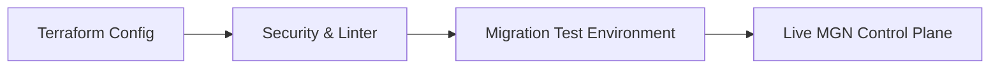

### 10. AIOps Modernization Drift & Risk Validation Flow
Using advanced analytics to identify sudden surges in replication lag, unauthorized cutover attempts, or unusual delivery pattern changes that could result in institutional risk or downtime.

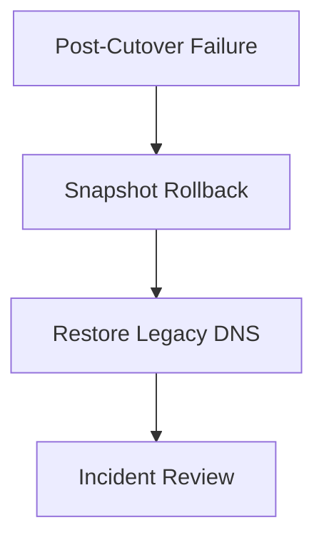

**Hypercare Support Flow:**
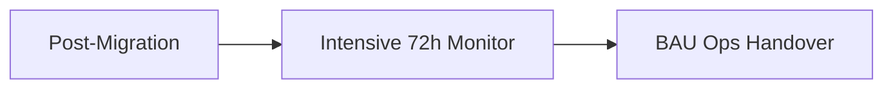

**Disaster Recovery Topology:**
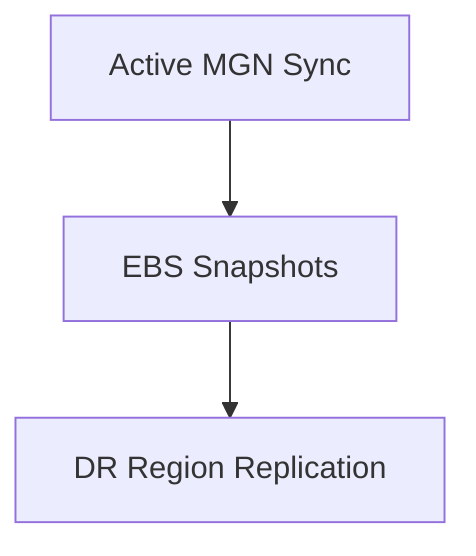

### 11. Metadata Lake for Forensic Modernization Audit
Storing long-term records of every migration integration event (metadata), every cutover executed, and every live stream telemetry for institutional record-keeping and forensic analysis.

---

## 🏛️ Core Governance Pillars

1.  **Unified Foundation Coordination**: Maximizing resilience by centralizing all modernization measurement through a single institutional plane.
2.  **Automated Wave Provisioning**: Eliminating "manual tracking" scenarios through proactive orchestration and pattern verification.
3.  **Sequential Modernization Intelligence**: Ensuring zero-interruption operations through dependency-aware cutover-driven data engineering.
4.  **Zero-Trust Identity Protection**: Automatically enforcing identity-based access, Direct Connect security, and policy evaluation across all assurance tiers.
5.  **Autonomous Operations Logic**: Guaranteeing reliability through automated industry-specific effectiveness monitoring runbooks.
6.  **Full Modernization Auditability**: Immutable recording of every cutover change and modernization provision for institutional forensics.

---

## 🛠️ Technical Stack & Implementation

### Modernization Engine & APIs
*   **Framework**: Python 3.11+ / FastAPI.
*   **Performance Engine**: Custom Python-based logic for multi-cloud dependency reconciliation and DORA-style modernization metrics.
*   **Integrations**: Native connectors for AWS MGN, CloudEndure, vCenter, and Active Directory.
*   **Persistence**: PostgreSQL (Modernization Ledger) and Redis (Live Replication State).
*   **Auth Orchestrator**: Federated OIDC/SAML for least-privilege modernization management access.

### Governance Dashboard (UI)
*   **Framework**: React 18 / Vite.
*   **Theme**: Dark, Slate, Indigo (Modern high-fidelity productivity aesthetic).
*   **Visualization**: D3.js for delivery topologies and Recharts for ROI velocity analytics.

### Infrastructure & DevOps
*   **Runtime**: AWS EKS or Azure Kubernetes Service (AKS) for management plane.
*   **Measurement Hub**: Managed event sourcing for immutable productivity timeline reconstruction.
*   **IaC**: Modular Terraform for deploying the modernization landing zone and validation fleet.

---

## 🏗️ IaC Mapping (Module Structure)

| Module | Purpose | Real Services |
| :--- | :--- | :--- |
| **`infrastructure/modernization_hub`** | Central management plane | EKS, PostgreSQL, Redis |
| **`infrastructure/enforcers`** | Distributed wave provisioners | Azure, AWS, GCP APIs |
| **`infrastructure/migration_pipes`** | Data Ingestion Hubs | Webhooks, Lambda |
| **`infrastructure/auditing`** | Forensic modernization sinks | S3, Athena, Quicksight |

---

## 🚀 Deployment Guide

### Local Principal Environment
```bash
# Clone the AWS MGN Automation repository
git clone https://github.com/devopstrio/aws-mgn-automation.git
cd aws-mgn-automation

# Configure environment
cp .env.example .env

# Launch the Modernization stack
make init

# Trigger a mock modernization update and automated guardrail validation simulation
make simulate-migration
```

Access the Management Portal at `http://localhost:3000`.

---

## 📜 License
Distributed under the MIT License. See `LICENSE` for more information.

---
<div align="center">
  <p>© 2026 Devopstrio. All rights reserved.</p>
</div>
